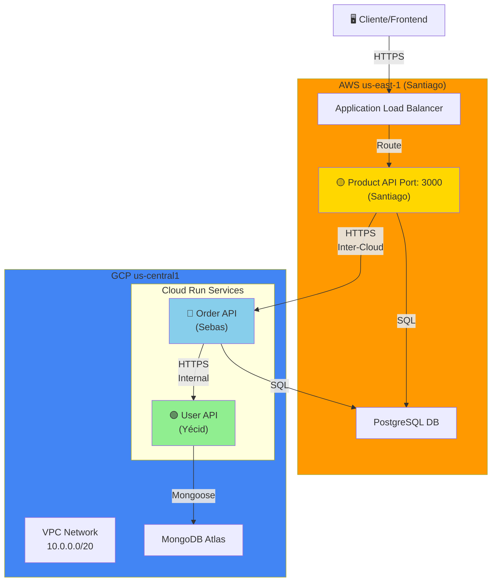
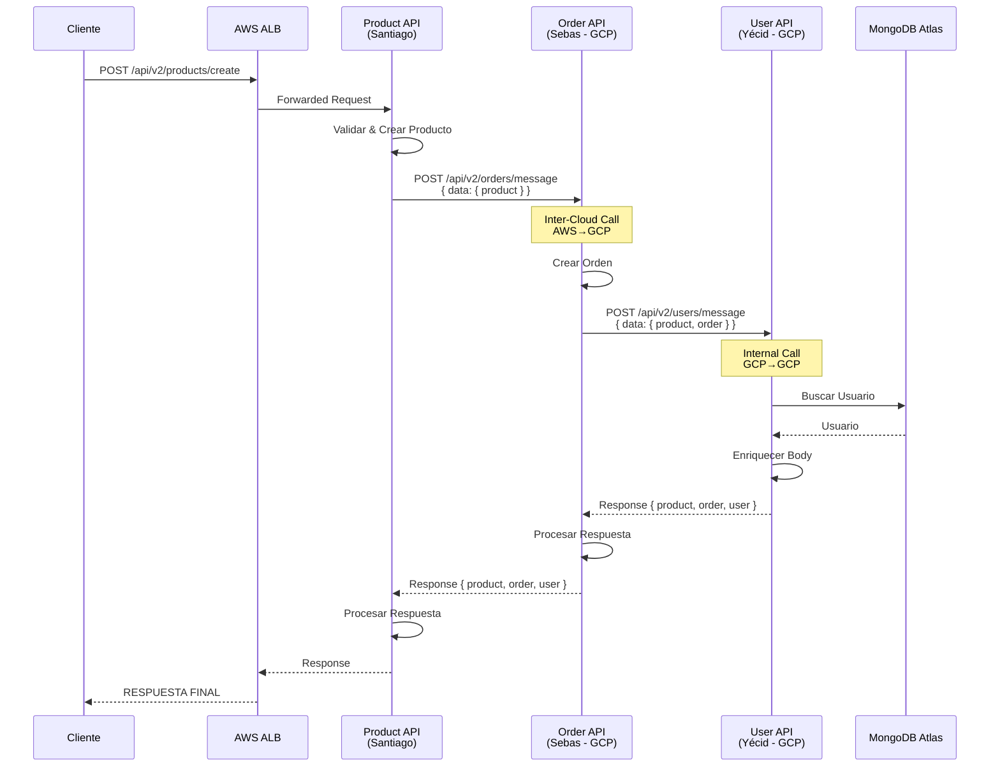
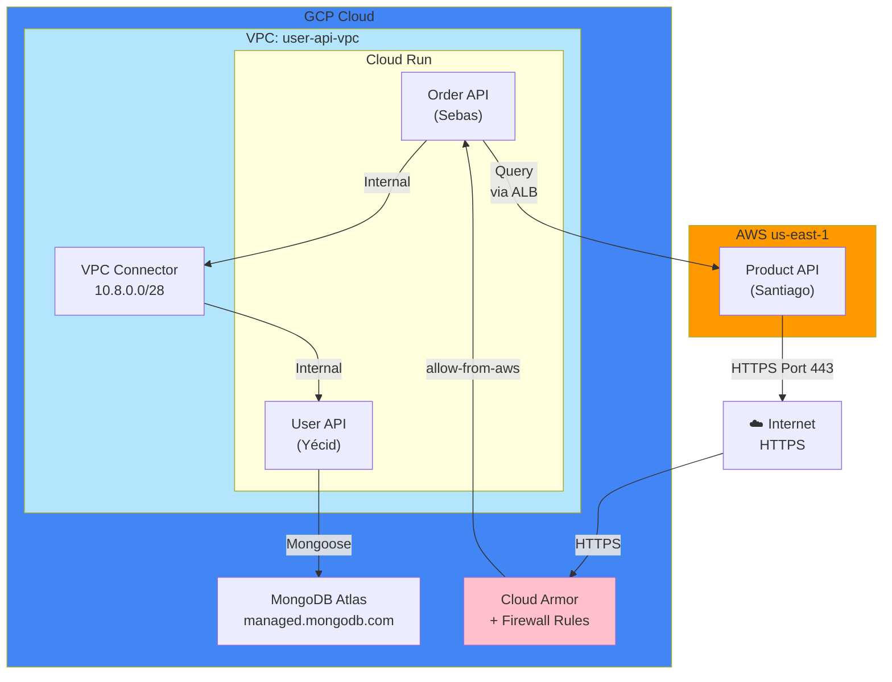
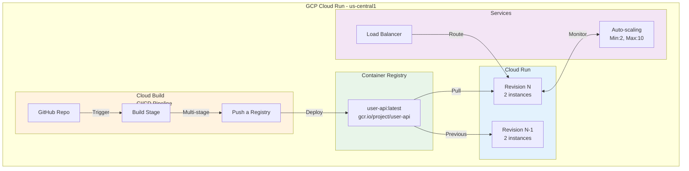
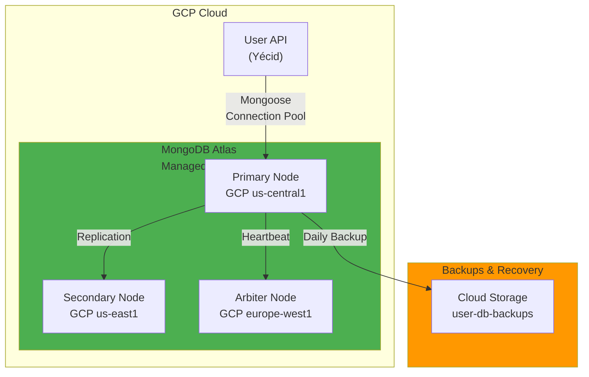
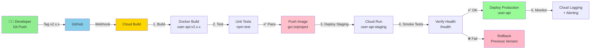
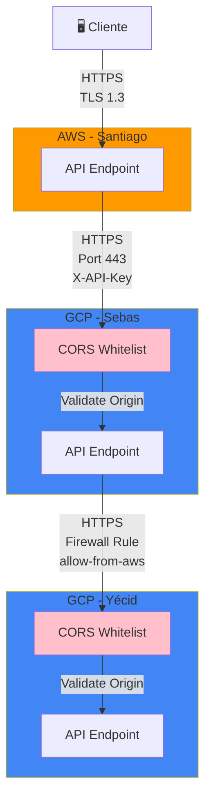
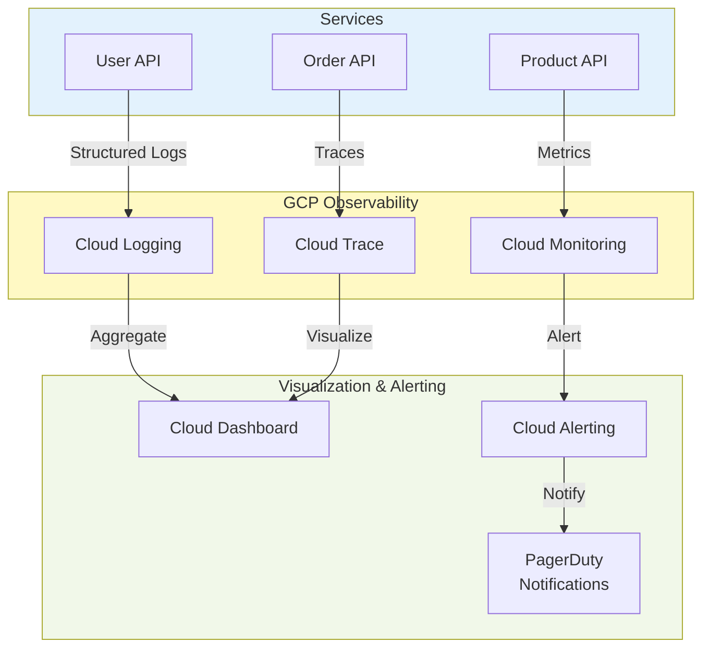
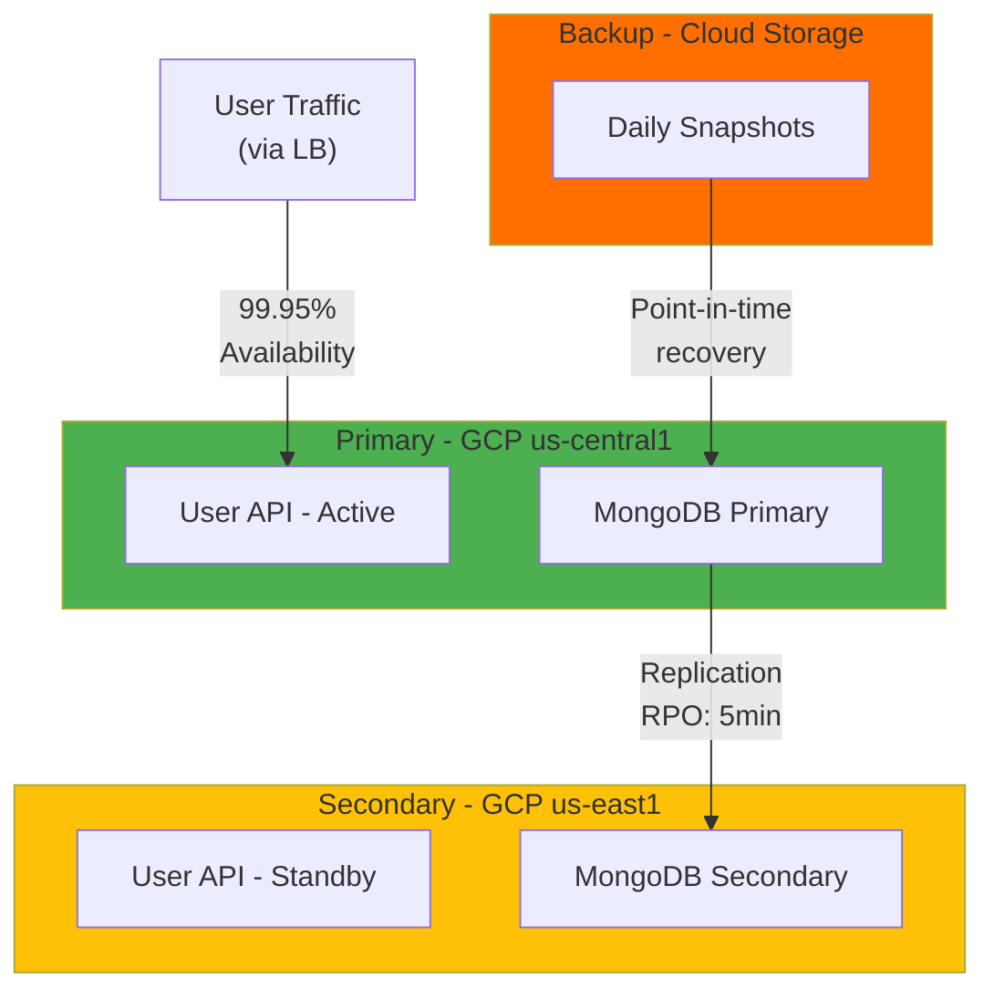

# 🏛️ Architecture Diagrams

## 1. Multicloud Architecture - High Level

## 2. Message Flow - Detallado

## 3. Network Topology - GCP

## 4. Cloud Run Deployment Architecture

## 5. Database Architecture

## 6. CI/CD Pipeline - Completo

## 7. Inter-Cloud Communication Security

## 8. Monitoring & Observability Stack

## 9. Disaster Recovery Plan

## Componentes Clave por Proveedor

### 🟡 AWS (Santiago)
- **Compute**: EC2 with Auto Scaling Group
- **Load Balancer**: Application Load Balancer (ALB)
- **Database**: RDS PostgreSQL (si aplica)
- **Networking**: VPC, Security Groups, NACLs
- **CDN**: CloudFront (opcional)

### 🔵 GCP (Yécid + Sebas)
- **Compute**: Cloud Run (serverless)
- **Orchestration**: Kubernetes (GKE) alternativa
- **Networking**: VPC, Cloud Armor
- **Database**: MongoDB Atlas + Cloud SQL
- **Observability**: Cloud Logging, Cloud Trace, Cloud Monitoring
- **Storage**: Cloud Storage para backups
- **Secret Management**: Secret Manager

### 🌐 Cross-Cloud
- **Communication**: HTTPS (TLS 1.3)
- **DNS**: Cloud DNS (GCP) + Route 53 (AWS)
- **Monitoring**: Cloud Monitoring (GCP)
- **CI/CD**: GitHub Actions + Cloud Build
